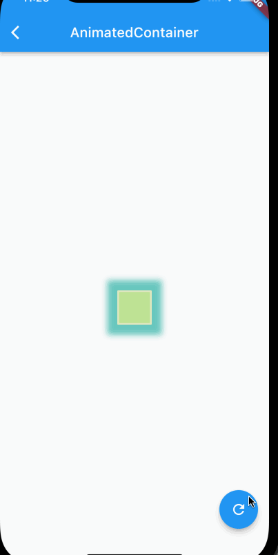

# Flutter 动画

## 隐式动画

隐式动画就是你没有显示的设置动画的效果，动画的处理是交由给内部自行处理。

### AnimatedContainer

一个带有动画的`Container`组件，当你对`Container`的属性发生修改的时候，会自动创建一个平滑的过渡动画。但是对`child`不起作用。他与`Container`只有一个参数的区别，`AnimatedContainer`多了一个`Duration`，用来控制动画的时长。

比如下面这个例子当中就对Container的width、height、color、圆角、阴影、边框等属性进行了修改，而AnimatedContainer就会给这些属性添加动画。

